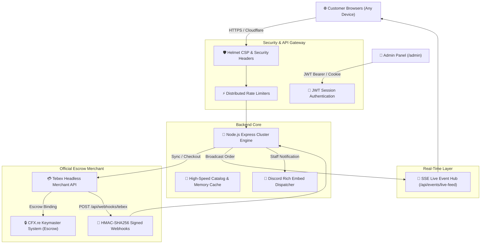

# 🛡️ Mirage Store - Advanced Enterprise Architecture & Deployment Guide

This document outlines the **Advanced Enterprise Architecture** implemented in your Mirage Store application.

---

## 🏗️ Architecture Overview



---

## 💎 Advanced Enterprise Features Built-In

### 1. 📡 Real-Time Server-Sent Events (SSE) Live Feed (`/api/events/live-feed`)
* Connected browsers maintain a lightweight, persistent HTTP stream.
* Whenever a customer purchases an asset (or an admin logs an order), the transaction is **broadcast instantly to every visitor's screen** in real time with an animated highlight without reloading the page.

### 2. 🔏 Cryptographic HMAC-SHA256 Webhook Verification (`POST /api/webhooks/tebex`)
* Ingests real-time purchase events directly from Tebex.
* Validates the `X-Tebex-Signature` header using SHA256 HMAC cryptographic hashing against your secret key to prevent forged requests.

### 3. 🤖 Automated Discord Rich Embed Webhooks
* If configured in `.env` (`DISCORD_WEBHOOK_URL`), the server dispatches staff alerts for:
  - 📦 New Asset Purchases (Customer name, item, price)
  - 🌟 New Verified Customer Reviews

### 4. 🔑 Cryptographically Signed JWT Admin Sessions
* The `/admin` dashboard issues signed JSON Web Tokens (`jwt`) stored in `httpOnly`, `SameSite: Strict` secure cookies.
* Protects administrative endpoints against Cross-Site Request Forgery (CSRF) and session tampering.

### 5. 🏥 Enterprise Health Check Probe (`GET /api/health`)
* Standard health monitoring endpoint for Kubernetes, Docker, and uptime bots:
  - Memory RSS & Heap usage
  - Live SSE client count
  - Server uptime seconds

---

## 📋 Environment Configuration (`.env`)

```env
PORT=3000
NODE_ENV=production
BASE_URL=https://yourdomain.com
JWT_SECRET=your_super_secret_jwt_key_2026

TEBEX_PUBLIC_TOKEN=zoxl-23e40774251c06d055bd84f1c5e7056c551986b1
TEBEX_PRIVATE_KEY=5BHLQXzxYPIQwxbqOQT1In3zvEwBJM7l
TEBEX_PROJECT_ID=1665273
NOTARY_PACKAGE_ID=7642742

ADMIN_PIN=mirage2026
DISCORD_WEBHOOK_URL=https://discord.com/api/webhooks/...
```

---

## 🚀 Deployment Options

### Option 1: Deploy on Railway (1-Click)
1. Push repository to GitHub.
2. Select repository on [railway.app](https://railway.app).
3. Add the `.env` variables under the **Variables** tab.

### Option 2: Deploy with Docker Compose
```bash
docker-compose up -d --build
```

### Option 3: Deploy on Ubuntu VPS with PM2 (Cluster Mode)
```bash
pm2 start ecosystem.config.js --env production
pm2 save
pm2 startup
```
